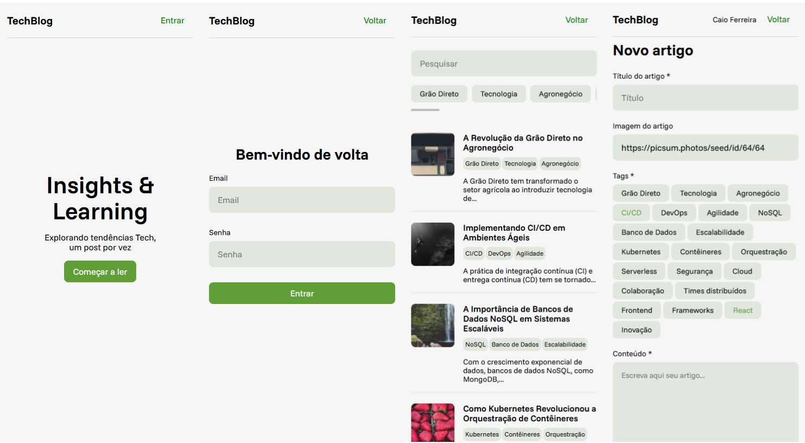

# Project

This project is divided into **server** and **client**.

---

## How to run the project

### Running the server

Open a terminal in the **server** folder and run:

```bash
npm run dev
```

After that, the server will be running at **localhost:3333** and will **serve the files from the `dist` folder**, which is located inside the **client** folder.

---

## Running on a mobile device on the same network

1. In the project, go to the folder: `client/src/services`

2. Open the file `configs.ts` and change the `baseURL` from `http://localhost:3333`

   to the **local IP address of the machine on the network**, for example:  
   `http://192.168.0.15:3333`

3. Start the server and, on your mobile device, access:  
   `http://LOCAL_MACHINE_IP:3333`

---

### Updating the client

Whenever there is any change in the **client** code, it is necessary to generate a new build.

Open a terminal in the **client** folder and run:

```bash
npm run build
```

This updates the `dist` folder, allowing the server to serve the most recent version of the project.

---

## Project architecture

The project consists of a **Node.js API** with a **SQLite** database.

SQLite was chosen for its **simplicity and practicality**, being sufficient for the scope of this test and making it easier to run the project locally without external dependencies.

---

### Server

The server is a **Node.js API** that works with **JSON Content-Type**.

Main technologies used:

- **Node.js**
- **SQLite**
- **Knex** for database connection
  - Migrations
  - Seeds
- **Zod** for data validation and typing
- **bcrypt** for password encryption
- **JSON Web Token (JWT)** for user authentication

All communication between client and server is done via JSON.

---

### Client

The client was developed using **React**, with **Vite** for project creation and build.

**TypeScript** is also used to maintain safer and more organized typing.

After the build process, the client generates the `dist` folder, which is served by the server.

---

## Project structure

### Client (`src`)

- **components** – reusable UI components
- **contexts** – global application contexts
- **hooks** – custom hooks
- **pages** – application pages
- **routes** – route definitions
- **services** – API communication
- **types** – TypeScript types and interfaces

---

### Server

- **configs** – general project configurations
- **controllers** – request handling and database communication
- **database** – database configuration, migrations, and seeds
- **middlewares** – application middlewares
- **routes** – project route definitions
- **types** – server-side typings
- **utils** – utility functions, such as error handling (e.g. `ApiError`)

---

### Application

Registered users:

- Email:
  `caio@email.com  
fred@email.com  
eduardo@email.com  
geovana@email.com  
carlos@email.com`

- Password: `123456`

## Screenshots


